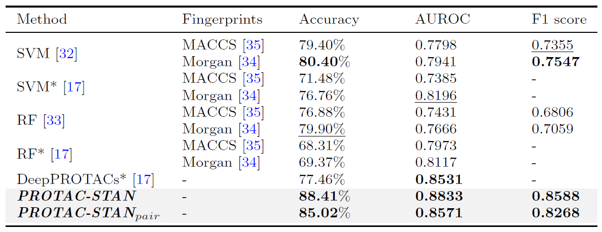

# PROTAC-STAN

 
 
[](https://colab.research.google.com/github/PROTACs/PROTAC-STAN/blob/main/demo.ipynb)

This is the official codebase of the paper: ["Interpretable PROTAC degradation prediction with structure-informed deep ternary attention framework"](https://www.biorxiv.org/content/10.1101/2024.11.05.622005v1)

## Overview

This study introduces *PROTAC-STAN*, a **structure-informed deep ternary attention network (STAN)** framework for interpretable PROTAC degradation prediction. It's the first study to coherently model the three-body interactions of PROTAC therapeutics with a tailored deep learning architecture. *PROTAC-STAN* represents PROTAC molecules across **atom, molecule, and property hierarchies** and incorporates **structure information** for POIs and E3 ligases using a protein language model infused with structural data. Furthermore, it simulates interactions among three entities via a **novel ternary attention network** tailored for the PROTAC system, providing unprecedented insights into the degradation mechanism.


## Datasets
### PROTAC-DB
The original data can be accessed at [PROTAC-DB](http://cadd.zju.edu.cn/protacdb/). 

### PROTAC-fine
We enrich degradation information to the [PROTAC-DB 2.0](https://academic.oup.com/nar/article/51/D1/D1367/6775390) and construct a refined PROTAC dataset named PROTAC-fine. The data are stored in `data/PROTAC-fine` folder. 

The data cleaning script is provided in `clean.ipynb`.

## Directory instructions

### Demo

```txt
.
├── config_demo.toml
├── data
│   └── demo
└── demo.ipynb
```

### Training and inference

```txt
.
├── config.toml
├── data
├── data_loader.py
├── data.py
├── inference.py
├── main.py
├── model.py
├── saved_models
└── tan.py
```

### Custom data preparation

```txt
.
├── data
│   └── custom
├── esm_embed
│   ├── get_embed_s.py
│   ├── model
│   └── README.md
└──  prepare_data.ipynb
```

### Pretrained models

```txt
# PROTAC-STAN
.
└── saved_models
    └── protac-stan.pt

# ESM-S
.
└── esm_embed
    └── model
        ├── esm2_t33_650M_UR50D.pt
        └── esm_650m_s.pth
```

Download the ESM model weights `esm2_t33_650M_UR50D.pt` from [here](https://github.com/facebookresearch/esm), and the structure-informed ESM model weights `esm_650m_s.pth` from [here](https://github.com/DeepGraphLearning/esm-s).

## Demo

[](https://colab.research.google.com/github/PROTACs/PROTAC-STAN/blob/main/demo.ipynb)

We provide PROTAC-STAN running demo through a Jupyter notebook `demo.ipynb`. Note it is based on a small demo dataset of PROTAC-fine. This demo only takes about 5 minutes to complete the whole pipeline. For running PROTAC-STAN on the full dataset, we advise GPU ram >= 8GB and CPU ram >= 16GB.

## System requirements

<!--  -->

PROTAC-STAN has been tested on **Linux** operating systems (Ubuntu 20.04.1). 

Python Dependencies:
- Python (version >= 3.11.5)
- PyTorch (version >= 2.1.0)
- RDKit (version >= 2023.9.2)
- pyg (version >= 2.5.1)

The full requirements are provided in `protac-stan.yml`

## Installation guide

It normally takes about 10 minutes to install on a normal desktop computer (based on your network).

1. Create Conda environment
``` shell
conda create -n protac-stan python=3.11.5
conda activate protac-stan
```
2. Install Pytorch
```shell
conda install pytorch==2.1.0 torchvision==0.16.0 torchaudio==2.1.0 pytorch-cuda=11.8 -c pytorch -c nvidia
conda install numpy==1.26.4
```
3. Install other essential packages
```shell
pip install torch_geometric==2.5.1
pip install rdkit==2023.9.2
pip install pandas==2.1.1
pip install toml==0.10.2
pip install wandb
# [Optional] Install torch-scatter to accelerate pyg computing
wget https://data.pyg.org/whl/torch-2.1.0%2Bcu118/torch_scatter-2.1.2%2Bpt21cu118-cp311-cp311-linux_x86_64.whl
pip install torch_scatter-2.1.2+pt21cu118-cp311-cp311-linux_x86_64.whl
```
4. Download repository
```shell
git clone https://github.com/PROTACs/PROTAC-STAN.git
cd PROTAC-STAN
```

> [!TIP]
> See `protac-stan.yml` for full requriements.

## Training to reproduce results

We have prepared the PROTAC-fine dataset in directory `data/PROTAC-fine`. 

To train the PROTAC-STAN model from scratch, run the following script:

```shell
python main.py
```
Evaluation results of PROTAC-STAN and baselines on test set considering data leakage:



## Inference on your data

`inference.py` leverage PROTAC-STAN as a powerful tool to perform interpretable PROTAC degradation prediction.

1. Prepare your customed data following `prepare_data.ipynb`
2. Predict your data:
```shell
# Usage: python inference.py [-h] [--root ROOT] [--name NAME] [--save_att]
python inference.py --root 'data/custom' --name 'custom'
```

You may use `--save_att` argument to save attention maps to take further anaysis, here are our examples:

> [!TIP]
> You may use Python packages like [matplotlib](https://matplotlib.org/stable/), [RDKit](https://www.rdkit.org/), Visualization software like [Maestro](https://www.schrodinger.com/platform/products/maestro/), [PyMOL](https://www.pymol.org/) and so on.

<details>
<summary> 3D and 2D attention map visualization </summary>

</details>

<details open>
<summary> Molecule and complex visualization </summary>

</details>

We also provide a simple PyMOL script `pymol_visualize.py` to assist with 3D visualization, see [here](https://github.com/PROTACs/PROTAC-STAN/tree/main/pymol_visualize).

## Citation
```tex
@misc{chen2024Interpretable,
  title = {Interpretable {{PROTAC}} Degradation Prediction with Structure-Informed Deep Ternary Attention Framework},
  author = {Chen, Zhenglu and Gu, Chunbin and Tan, Shuoyan and Wang, Xiaorui and Li, Yuquan and He, Mutian and Lu, Ruiqiang and Sun, Shijia and Hsieh, Chang-Yu and Yao, Xiaojun and Liu, Huanxiang and Heng, Pheng-Ann},
  year = {2024},
  primaryclass = {New Results},
  pages = {2024.11.05.622005},
  doi = {10.1101/2024.11.05.622005},
  urldate = {2024-11-09},
  archiveprefix = {bioRxiv},
  chapter = {New Results}
}
```
