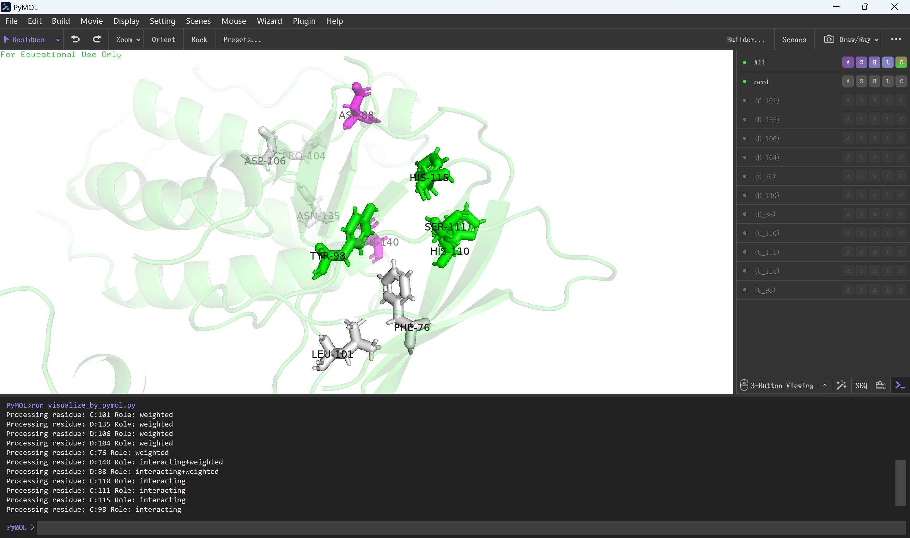

# PyMOL Visualization of Key Residues

## Introduction

An example script for visualizing key residues on protein structures using PyMOL, to assist with structural analysis and functional studies.

## Installation

Make sure PyMOL is installed. You can install it with the following command:

```bash
conda install -c schrodinger -c conda-forge pymol
```

## Usage

Activate your environment and run the script:

```bash
conda activate pymol
```

In the GUI, run the following command:

```bash
run visualize_by_pymol.py
```

Example output:

